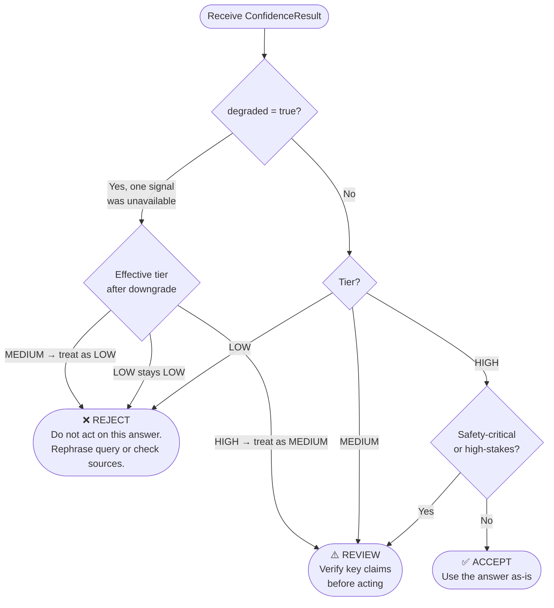

# Decision Rules — GroundCheck Confidence Tiers

This document defines the **actionable decision rules** for each confidence tier produced by the GroundCheck engine. It is intended for users who need to decide what to do with an AI-generated answer after seeing its confidence score.

For a plain-language explanation of what the tiers mean, see [`confidence_tiers.md`](confidence_tiers.md).

---

## Quick Reference

| Score | Tier   | Action   | Risk     |
|-------|--------|----------|----------|
| 70–100 | HIGH  | **Accept** — safe to use | Low |
| 40–69  | MEDIUM | **Review** — verify before acting | Medium |
| 0–39   | LOW   | **Reject** — do not act on this answer | High |

**Degraded flag override:** if `degraded: true` is set in the output, apply one downgrade: treat HIGH as MEDIUM, and treat MEDIUM as LOW. See [Degraded Mode](#degraded-mode) below.

---

## Decision Flowchart



---

## Tier Decision Rules

### HIGH — Score 70 to 100

**Decision: Accept**

The answer is well-supported by retrieved documents and the model generated it with measurable confidence. It is safe to use in most contexts.

**Criteria to accept:**
- Score ≥ 70
- `degraded` is `false`
- The context is not safety-critical or high-stakes

**Criteria to escalate to Review instead:**
- Score ≥ 70 but `degraded: true` → treat as MEDIUM (see [Degraded Mode](#degraded-mode))
- The downstream decision has significant real-world consequences (regulatory, safety, financial) — apply human review regardless of score

**Risk considerations:**
- Even a HIGH score does not guarantee factual accuracy. It means the answer is consistent with the retrieved documents, and those documents may themselves be incomplete or outdated.
- A HIGH score with `grounding_supported` < `grounding_num_claims` means some claims went unverified. This is still HIGH if the overall score clears the threshold, but the unsupported claims carry residual risk.

**Example — Accept:**
```json
{
  "score": 99,
  "tier": "HIGH",
  "degraded": false,
  "signals": {
    "grounding_score": 0.981,
    "grounding_num_claims": 2,
    "grounding_supported": 2,
    "gen_confidence_level": "HIGHLY_CONFIDENT"
  },
  "explanation": "The answer is strongly supported by the retrieved documents (2 of 2 claims verified). The model generated the response with high confidence. This answer is safe to use."
}
```
→ **Action: Accept.** Both claims verified, model was confident, score 99. Use the answer.

---

### MEDIUM — Score 40 to 69

**Decision: Review**

The answer has partial support from documents or the model showed moderate-to-uncertain confidence. It is a useful starting point but should not be acted on without verification.

**Criteria to review:**
- Score is 40–69 (inclusive)
- At least one of: grounding is partial (`grounding_supported < grounding_num_claims`), or gen confidence level is MODERATE or UNCERTAIN

**What to verify:**
1. Read the answer in full.
2. Identify which claims are load-bearing for your decision.
3. Cross-check those claims against the source documents or an authoritative reference.
4. Only proceed if the specific claims you are relying on are verifiable.

**Criteria to escalate to Reject instead:**
- Score is 40–69 but `degraded: true` → treat as LOW (Reject)
- The specific claims you need are not supported by any retrieved chunk

**Risk considerations:**
- MEDIUM often means the retrieval system found *some* relevant documents but not all. The answer may be missing key steps, caveats, or constraints that are outside the ingested document set.
- A high `gen_confidence_level` (HIGHLY_CONFIDENT) with a low grounding score is a warning sign: the model was confident but the documents do not back it up. This pattern is associated with plausible-sounding hallucinations.

**Example — Review (partial grounding):**
```json
{
  "score": 54,
  "tier": "MEDIUM",
  "degraded": false,
  "signals": {
    "grounding_score": 0.62,
    "grounding_num_claims": 5,
    "grounding_supported": 3,
    "gen_confidence_level": "MODERATE"
  },
  "explanation": "The answer is partially supported by the retrieved documents (3 of 5 claims verified). The model showed moderate confidence during generation. Verify the key claims before acting on this answer."
}
```
→ **Action: Review.** 2 of 5 claims unverified. Identify which claims matter for your use case and check them before proceeding.

**Example — Review (confident model, weak grounding):**
```json
{
  "score": 47,
  "tier": "MEDIUM",
  "degraded": false,
  "signals": {
    "grounding_score": 0.44,
    "grounding_num_claims": 4,
    "grounding_supported": 1,
    "gen_confidence_level": "HIGHLY_CONFIDENT"
  },
  "explanation": "The retrieved documents provide little support for this answer (1 of 4 claims verified). The model generated the response with high confidence. Verify the key claims before acting on this answer."
}
```
→ **Action: Review with caution.** The model is confident but the documents barely support the answer. The model may be drawing on training data rather than retrieved sources — verify everything before acting.

---

### LOW — Score 0 to 39

**Decision: Reject**

The retrieved documents do not support this answer. The risk of acting on a hallucination or out-of-scope response is high.

**Criteria to reject:**
- Score < 40

**What to do instead of rejecting outright:**
1. **Rephrase the query.** The retrieval system may surface better documents with a different wording.
2. **Check corpus coverage.** The relevant documents may not have been ingested. If you know the answer should be in the system, flag it for the document ingestion team.
3. **Escalate to a subject-matter expert.** If an answer is needed urgently and no better retrieval is possible, a human expert should answer directly.
4. **Do not cache or forward the answer** downstream — treat it as if no answer was produced.

**Risk considerations:**
- A LOW score with a high `gen_confidence_level` (HIGHLY_CONFIDENT) is the highest-risk pattern. The model is certain, but its certainty is not grounded in the retrieved documents. This is the classic hallucination signature.
- A LOW score with UNCERTAIN gen confidence is also a Reject, but for a different reason: the model itself was unsure and the documents provide no support. The answer should simply not be used.

**Example — Reject (hallucination risk):**
```json
{
  "score": 22,
  "tier": "LOW",
  "degraded": false,
  "signals": {
    "grounding_score": 0.11,
    "grounding_num_claims": 3,
    "grounding_supported": 0,
    "gen_confidence_level": "HIGHLY_CONFIDENT"
  },
  "explanation": "The retrieved documents provide little support for this answer (0 of 3 claims verified). The model generated the response with high confidence. Do not rely on this answer without additional verification."
}
```
→ **Action: Reject.** Zero claims verified. High model confidence with zero grounding is the hallucination pattern. Do not use this answer.

**Example — Reject (out of scope):**
```json
{
  "score": 9,
  "tier": "LOW",
  "degraded": false,
  "signals": {
    "grounding_score": 0.08,
    "grounding_num_claims": 2,
    "grounding_supported": 0,
    "gen_confidence_level": "UNCERTAIN"
  },
  "explanation": "The retrieved documents provide little support for this answer (0 of 2 claims verified). The model was uncertain while generating the response. Do not rely on this answer without additional verification."
}
```
→ **Action: Reject.** Both signals are weak. The question is likely outside the scope of the ingested document set. Check corpus coverage before re-querying.

---

## Degraded Mode

The `degraded` flag is set to `true` when one of the two signals could not be computed — for example, if the vLLM server did not return logprobs (Signal 2 missing), or if the NLI model failed to load (Signal 1 missing).

In degraded mode the score is still meaningful, but it is less reliable because it reflects only one signal. Apply the following downgrade:

| Tier in degraded output | Effective decision |
|---|---|
| HIGH (degraded) | Treat as MEDIUM → **Review** |
| MEDIUM (degraded) | Treat as LOW → **Reject** |
| LOW (degraded) | Stays LOW → **Reject** |

**Why downgrade?** If only one signal is available, the confidence interval around the score is wider. A degraded HIGH could be a true HIGH or a true MEDIUM — when you can't tell, the safer action is to review rather than accept.

**Example — Degraded HIGH:**
```json
{
  "score": 85,
  "tier": "HIGH",
  "degraded": true,
  "warning": "Generation confidence unavailable. Using Grounding Score only.",
  "signals": {
    "grounding_score": 0.85,
    "gen_confidence_normalized": null
  }
}
```
→ **Action: Review** (not Accept). Score is 85 and grounding is strong, but gen confidence is missing. Treat as MEDIUM and verify before acting.

---

## Risk Matrix

| Tier | Degraded | Risk Level | Decision |
|------|----------|------------|----------|
| HIGH | No | Low | Accept |
| HIGH | Yes | Medium | Review |
| MEDIUM | No | Medium | Review |
| MEDIUM | Yes | High | Reject |
| LOW | No | High | Reject |
| LOW | Yes | High | Reject |

**Additional risk modifiers (apply regardless of tier):**
- **Safety-critical use** (regulatory, physical safety, medical, legal) → require human review for any output, even HIGH non-degraded
- **High model confidence + low grounding** → flag as hallucination risk even if the tier would normally be MEDIUM; treat as LOW
- **Single-claim answer** — if `grounding_num_claims = 1` and that claim is unsupported, the grounding score is 0 regardless of how long the answer is; treat as LOW

---

## User Guidelines

### I'm seeing a lot of MEDIUM or LOW scores — what's wrong?

Nothing is necessarily wrong with the engine. Common causes:

1. **The relevant documents aren't ingested.** If a user asks about a policy that hasn't been uploaded, the retrieval system has nothing to find. The answer will be LOW.
2. **The query is too broad.** A vague question retrieves generic chunks that don't specifically support any individual claim. Narrow the question.
3. **The model is answering from training data.** A confident-sounding answer with near-zero grounding is the model relying on its pre-training rather than the retrieved documents. This is normal when the question is out of scope.

### The answer looks correct to me but the score is LOW — should I trust my judgement?

Be careful. The score measures how much the retrieved documents support the answer, not whether the answer is true. If the answer looks correct but scores LOW, one of these is likely:

- The correct documents aren't in the system (out-of-scope, not ingested)
- The answer is correct but worded differently than the documents (paraphrase the answer; re-run if needed)
- The answer is wrong and you are pattern-matching to what you expect to be true

In all three cases, **don't act on the answer without verifying against a primary source.**

### When should I override a REJECT decision?

Only in these circumstances:
- A subject-matter expert has independently verified the specific claims you need
- You have confirmed that the relevant documents are missing from the corpus and the answer is correct based on your own knowledge
- The decision is reversible and low-stakes

Document the override and the reason. Never override a Reject in safety-critical or high-stakes contexts.

### What does the explanation text add?

The explanation (the `explanation` field in the output) restates the decision in plain English for end users who are not reading raw JSON. It is generated deterministically from the signal values — it is not a second AI opinion. The decision rules above are the ground truth; the explanation is a readable summary of them.

---

## Decision Rules Summary

```
Receive score + tier + degraded flag
│
├─ degraded = true?
│   └─ Yes → downgrade one level:  HIGH→MEDIUM, MEDIUM→LOW
│
├─ tier = HIGH, degraded = false
│   ├─ safety-critical context?  → REVIEW
│   └─ otherwise                 → ACCEPT
│
├─ tier = MEDIUM (or degraded HIGH)
│   ├─ no claims verifiable?     → REJECT
│   └─ otherwise                 → REVIEW (verify load-bearing claims)
│
└─ tier = LOW (or degraded MEDIUM)
    └─ always                    → REJECT
        → rephrase query, check corpus, escalate to SME
```

---

*Score thresholds and weights are defined in `confidence/config.py` and applied in `confidence/fusion.py`.*
*Tier definitions: see [`confidence_tiers.md`](confidence_tiers.md).*
